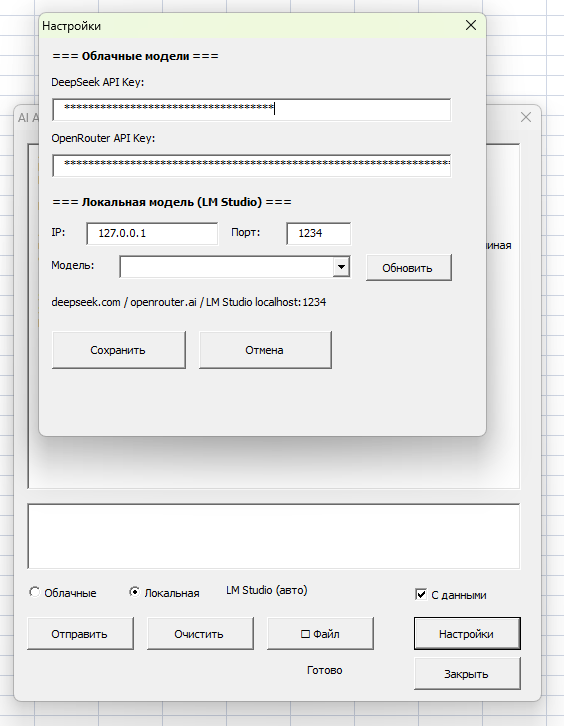

# AI Assistant for Excel (VBA)

Надстройка для Microsoft Excel с AI-чатом, контекстом книги и выполнением команд в таблице.




## Почему проект сильный для портфолио

- Реальный desktop automation продукт на VBA
- Интеграция с несколькими AI-провайдерами
- Собственный command protocol (`commands`) и исполнение в Excel
- Публичная модульная архитектура и CI-проверки

## Возможности

- AI-чат с учетом активной книги и выделения
- Поддержка DeepSeek, OpenRouter (Claude/GPT/Gemini), LM Studio
- Работа с изображениями (Vision)
- Выполнение команд Excel из блока `commands`
- Поддержка графиков, сводных, форматирования, валидации и др.

## Демо

- [Видео 1](videos/Пример1.mp4)
- [Видео 2](videos/Пример%202.mp4)

## Публичная структура исходников

Код для разработки и ревью находится в `src-vba/public`:

- `modules/modAIConfig.bas` — ключи API и настройки LM Studio
- `modules/modAINetwork.bas` — JSON/HTTP и вызовы AI-провайдеров
- `modules/modAICommands.bas` — разбор и выполнение Excel-команд
- `modules/modExcelHelper.bas` — сбор контекста книги
- `modules/modMain.bas` — запуск форм и меню add-in
- `forms/*` — код форм (`frmChat`, `frmSettings`)
- `classes/*` — классы книги/листа

## Архитектура

- Архитектура и потоки: [docs/ARCHITECTURE_RU.md](docs/ARCHITECTURE_RU.md)
- Layout исходников: [docs/VBA_SOURCE_LAYOUT_RU.md](docs/VBA_SOURCE_LAYOUT_RU.md)
- Smoke QA: [docs/QA_SMOKE_TESTS_RU.md](docs/QA_SMOKE_TESTS_RU.md)

## Установка надстройки

1. Скачайте `AI_Assistant.xlam` из Releases.
2. В Excel откройте: `Файл -> Параметры -> Надстройки`.
3. Внизу выберите `Управление: Надстройки Excel -> Перейти`.
4. Нажмите `Обзор`, выберите `AI_Assistant.xlam`, включите галочку.
5. Разрешите макросы в Центре управления безопасностью.

## Настройка

1. Откройте ассистент: `Alt+F8 -> ShowAIAssistant`.
2. Перейдите в `Настройки`.
3. Укажите ключи:
- DeepSeek: `platform.deepseek.com`
- OpenRouter: `openrouter.ai`
4. Для локального режима задайте LM Studio IP/порт (обычно `127.0.0.1:1234`).

## Разработка

### Импорт VBA исходников

1. Откройте `AI_Assistant.xlam`.
2. Откройте VBA Editor (`Alt+F11`).
3. Импортируйте модули/формы/классы из `src-vba/public/*`.
4. Сохраните надстройку.

### Автосборка публичного layout из `.xlam`

```bash
python tools/build_public_sources.py AI_Assistant.xlam
```

### CI

Workflow: `.github/workflows/ci.yml`

Проверяет:
- синтаксис tool-скриптов
- целостность структуры репозитория
- воспроизводимость генерации `src-vba/public`

## Open Source

- Contribution guide: [CONTRIBUTING.md](CONTRIBUTING.md)
- Security policy: [SECURITY.md](SECURITY.md)
- PR template: [.github/pull_request_template.md](.github/pull_request_template.md)
- Release template: [.github/release_template.md](.github/release_template.md)
- Case study: [CASE_STUDY_RU.md](CASE_STUDY_RU.md)
- Changelog: [CHANGELOG.md](CHANGELOG.md)

## Системные требования

- Microsoft Excel 2007+
- Windows 8/10/11
- Интернет для облачных моделей (или LM Studio для локальных)

## Безопасность

- API-ключи хранятся в `HKEY_CURRENT_USER\Software\ExcelAIAssistant`
- Данные отправляются только выбранному провайдеру
- При LM Studio данные остаются локально

## Лицензия

MIT
